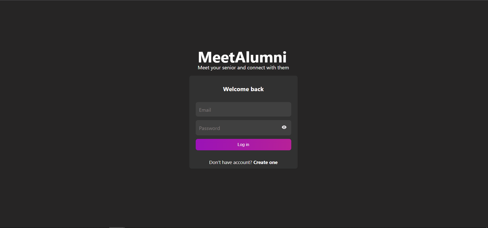
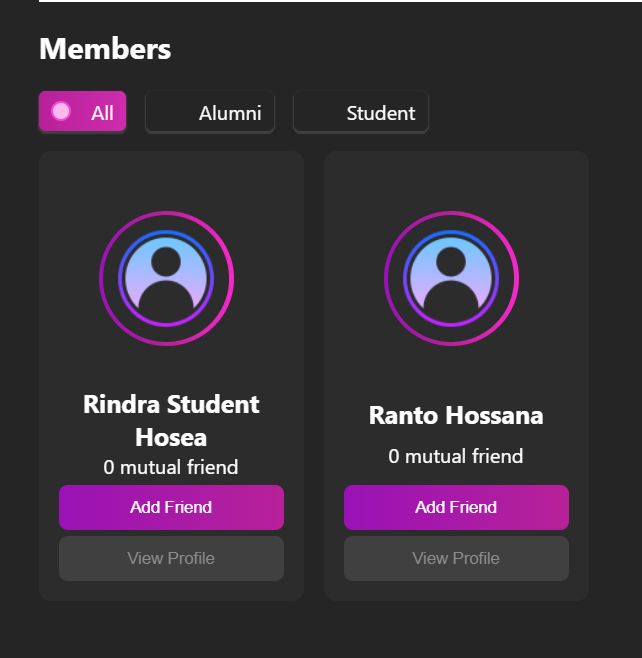

# MeetAlumni

MeetAlumni is a platform to let students connect with their senior.

## Requirements
The backend server should be installed. To install it, clone the project in this repository: [MeetAlumni Backend](https://github.com/Hosea2003/meet-alumni-back.git)

Clone the project and run this command to install all the dependecies:

```bash
  npm install
```

## Run Locally
```bash
  npm start
```

## Preview of the project



